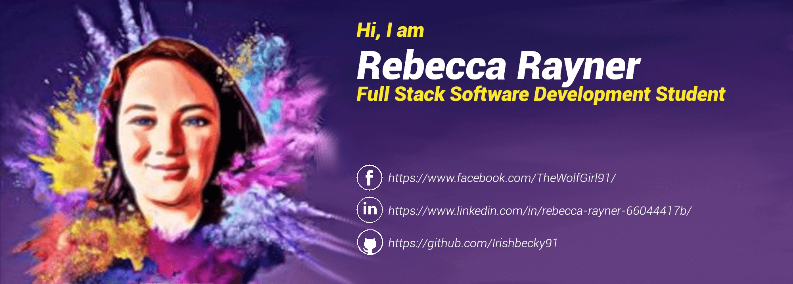

## A little bit about me 

**Hello there :wave::grinning:**

My name is Rebecca Rayner. I am an Anglo-Irish woman living in Ireland, and am a full stack software developer in training. 

Before starting the full stack course with [Code Institute](https://codeinstitute.net/), I had only tried some basic coding using a mobile app called [Mimo](https://getmimo.com/). I have always been fascinated by how things work, including websites. I finally decided to try it out and now I'm hooked!

Learning the basics from this app was the push I needed to start my coding journey as I found not only a new hobby, but a passion I wished to pursue as a career. 

While learning with Code Institute I have taken part in two Hackathons, one of which earned our team a second place. 

## Stack 

- ### **In my stack**
                    

- ### **Learning in progress**         
             

## Objectives
- My objectives are also to learn React, Node.js and Ruby       
       

## GitHub statistics

<!--   -->

 

## Contacts

 
 

## Credits

Thank you [Terence Eden & co](https://github.com/edent/SuperTinyIcons) and [devicon](https://github.com/devicons) for the icons, and [Anurag Hazra](https://github.com/anuraghazra/github-readme-stats) for the GitHub stats.
